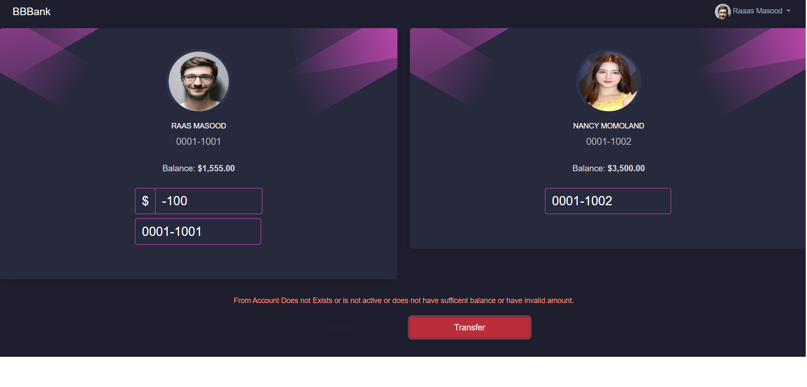

# **Microsoft Rules Engine**  
The **Business Rules Framework is a Microsoft .NET-compliant class library**. It provides **an efficient inference engine that can link highly readable, declarative, semantically rich rules** to any business objects (.NET components), XML documents, or database tables. 

**Application developers can build business rules by constructing rules from small building blocks of business logic** (small rule sets) that operate on information (facts) contained in .NET objects, database tables, and XML documents.

## **Features**
* **Json based rules** definition
* **Multiple input** support
* **Dynamic object input** support
* **C# Expression** support
* **Extending expression** via custom class/type injection
* **Scoped parameters**
* **Post rule execution actions**

## **Previous Implementations**
We have a front-end and back-end code-bases as the base project 
### **Frontend Code Base:**
Previously, we scaffolded a new Angular application in which we have 
* **FontAwesome library** for icons
* **Bootstrap library** for styling 
* **Bootstrap navbar** implemented


_____________

### **Backend Code Base:**
Previously, we have developed Accounts APIs which are **GetAllAccounts** and **GetAllAccountsPaginated**. We will call the followings API to get all accounts which will return the result as in the image given below
http://localhost:5070/api/Accounts/GetAllAccounts


There are 4 Projects in the solution. 

*	**Entities** : This project **contains DB models** like User where each User has one Account and each Account can have one or many Transactions. There is also a Response Model of LineGraphData that will be returned as API Response. 

*	**Infrastructure**: This project **contains BBBankContext** that service as fake DBContext that populates one User with its corresponding Account that has three Transactions dated of last three months with hardcoded data. 

* **Services**: This project **contains TransactionService** with the logic of converting Transactions into LineGraphData after fetching them from BBBankContext.

* **BBBankAPI**: This project **contains TransactionController** with 2 GET methods `GetLast12MonthBalances` & `GetLast12MonthBalances/{userId}` to call the TransactionService.


-----------

## **In this Exercise**
We will implement Rules Engine and the code base will include both front-end and back-end code-bases
## Front-End Codebase
* Create a **transfer-funds component**
* Add **Transfer method** in transaction service 
* Create an **accounts service**
* Create **AccountByX, Account, TransferRequest, TransferResult and User models**
* Add **routing for transfer-funds component** in app-routing module 

## Back-End Codebase 
* Add **new action methods in accounts controller**
* Add **new methods in accounts service and its contract**  
* Create a **new response model AccountByUserResponse** in Entities
* Add **Transfer action method in transaction controller**  
* Create a **new models TransferRequest and RuleResult** in Entities 
* Add a **new method TransferFunds in transaction service and its contract** 
* Add a **new JSON file `BBBankRules.json`** in BBBankAPI 
* Create a **new service RulesService and its contract** 
  
  also in a pipeline - builder.Services.AddScoped<IRulesService, RulesService>();

* **Install RulesEngine and Nito.AsyncEx.Context packages** 
* Create a **new class Eval_TransferRules** in RulesFunctions folder in Services

## **Implementation**
We will implement above steps for Rules Engine 

## Front-end Implementation
### **Step 1: Transfer-funds Component**
Create a new component `transfer-funds.component` on the app directory. In this component a user can transfer some amount from his account to some other account by entering the account number. 

Here is the code below:

### **TransferFunds Template Code**
```html
<div class="row">
    <div class="col-12 col-sm-6">

        <div class="card card-user">
            <div class="card-body">
                <div class="author">
                    <div class="block block-one"></div>
                    <div class="block block-two"></div>
                    <div class="block block-three"></div>
                    <div class="block block-four"></div>

                    
                    <h5 class="title">{{fromAccount.accountTitle}}</h5>
                    <p class="account-number"> {{fromAccount.accountNumber}}</p>
                    <p class="balance">Balance: <b>{{fromAccount.currentBalance | currency}}</b> <span
                            *ngIf="fromAccount?.accountStatus === 'Active'"
                            class="account-status active">Active</span><span
                            *ngIf="fromAccount?.accountStatus === 'InActive'"
                            class="account-status inactive">Inactive</span></p>

                    <div class="amount-cont">
                        <div class="form-row">
                            <div class="col-sm-2"></div>
                            <div class="col-sm-8 my-1">
                                <div class="input-group mb-2">
                                    <div class="input-group-prepend" style="margin-left: 50%">
                                        <div class="input-group-text">$</div>
                                    </div>
                                    <input type="number" [(ngModel)]="amount" class="form-control align-self-center"
                                        id="depositAmount" placeholder="Transfer Amount">
                                </div>
                            </div>
                            <div class="col-sm-2"></div>
                        </div>
                    </div>

                    <div class="amount-cont">
                        <div class="form-row">
                            <div class="col-sm-2"></div>
                            <div class="col-sm-8 my-1">
                                <input type="text" [(ngModel)]="fromAccount.accountNumber"
                                    style="margin-left: 50%; width: 240px;" class="form-control"
                                    id="fromAccountNumber" placeholder="From Account ID">
                            </div>
                            <div class="col-sm-2"></div>
                        </div>
                    </div>

                </div>
                <div class="card-description">&nbsp;</div>
            </div>
        </div>

    </div>
    <div class="col-12 col-sm-6">

        <div class="card card-user">
            <div class="card-body">
                <div class="author">
                    <div class="block block-one"></div>
                    <div class="block block-two"></div>
                    <div class="block block-three"></div>
                    <div class="block block-four"></div>

                    
                    <h5 class="title">{{toAccount?.accountTitle}}</h5>
                    <p class="account-number">{{toAccount?.accountNumber}}</p>
                    <p class="balance">Balance: <b>{{toAccount.currentBalance | currency}}</b> <span
                            *ngIf="toAccount?.accountStatus === 'Active'"
                            class="account-status active">Active</span><span
                            *ngIf="toAccount?.accountStatus === 'InActive'"
                            class="account-status inactive">Inactive</span></p>
                    <div class="amount-cont">
                        <div class="form-row">
                            <div class="col-sm-2"></div>
                            <div class="col-sm-8 my-1">
                                <input type="text" [(ngModel)]="toAccount.accountNumber"
                                    style="margin-left: 50%; width: 240px;" class="form-control"
                                    id="depositAccountNumber" placeholder="To Account ID" (focusout)="getToAccount()">
                            </div>
                            <div class="col-sm-2"></div>
                        </div>
                    </div>
                </div>
                <div class="card-description">&nbsp;</div>
            </div>
        </div>

    </div>
</div>

<div class="row">
    <div class="col-12">
        <div class="error-message">
            <p class="text-warning">
                {{message}}
            </p>
        </div>

        <br>


        <div class="row">
            <div class="col-sm-6 mb-3">
                <button class="btn btn-cancel btn-block" (click)="initialize()"
                    style="width: 30%;margin-left: 70%;">Cancel</button>
            </div>
            <div class="col-sm-6 mb-3">
                <button class="btn btn-danger btn-block" (click)="transfer()" style="width: 30%">Transfer</button>
            </div>
        </div>

    </div>
</div>
```

### **TransferFunds Typescript Code**

```ts
import { Component, OnInit } from '@angular/core';
import { ActivatedRoute } from '@angular/router';
import { AccountByX } from '../models/AccountByX';
import TransferRequest from '../models/TransferRequest';
import { TransferResult } from '../models/TransferResult';
import AccountsService from '../services/accounts.service';
import { TransactionService } from '../services/transaction.service';

@Component({
  selector: 'app-transfer-funds',
  templateUrl: './transfer-funds.component.html',
  styleUrls: ['./transfer-funds.component.css']
})

export class TransferFundsComponent implements OnInit {
  userId: string | undefined;
  fromAccount = new AccountByX();
  toAccount = new AccountByX();
  amount: number = 0;
  message: string;

  constructor(private route: ActivatedRoute,
    private accountsService: AccountsService,
    private transactionService: TransactionService) { }

  ngOnInit(): void {
    this.initialize();
    this.userId = 'aa45e3c9-261d-41fe-a1b0-5b4dcf79cfd3';
    this.accountsService
      .getAccountByUser(this.userId)
      .subscribe({
        next: (data) => {
          this.initializeFrom(data);
        },
        error: (error) => {
        },
      });
  }

  getToAccount() {
    this.accountsService
      .getAccountByAccountNumber(this.toAccount.accountNumber)
      .subscribe({
        next: (data) => {
          this.initializeTo(data);
        },
        error: (error) => {
        },
      });
  }

  initializeToAccountDefault() {
    this.toAccount = new AccountByX();
    this.toAccount.accountNumber = "XXXX-XXXX"
    this.toAccount.accountTitle = "Unknown"
    this.toAccount.currentBalance = 0;
    this.toAccount.userImageUrl = '../../assets/images/noprofile.png'
  }

  initializeTo(data: any) {
    this.toAccount = new AccountByX();
    this.toAccount.accountNumber = data.accountNumber
    this.toAccount.accountTitle = data.accountTitle
    this.toAccount.currentBalance = data.currentBalance
    this.toAccount.userImageUrl = '../../assets/images/nancy.jpg'
  }

  initializeFrom(data: any) {
    this.fromAccount = new AccountByX();
    this.fromAccount.accountNumber = data.accountNumber
    this.fromAccount.accountTitle = data.accountTitle
    this.fromAccount.currentBalance = data.currentBalance
    this.fromAccount.userImageUrl = '../../assets/images/profile.jpg'
  }

  initialize() {
    this.amount = 0;
    this.initializeToAccountDefault();
  }
  transfer() {
    const transferRequest: TransferRequest = {
      accountFromId: this.fromAccount.accountNumber,
      accountToId: this.toAccount.accountNumber,
      amount: this.amount
    };
    this.transactionService
      .transfer(transferRequest)
      .subscribe({
        next: (result: TransferResult) => {
          if (result.isSuccess) {
            this.fromAccount.currentBalance -= this.amount;
            this.toAccount.currentBalance += this.amount;
            this.amount = 0;
            this.message = ''
          } else {
            this.message = result.errors
          }
        },
        error: (err) => {
        },
      });
  }
}
```

### **TransferFunds Stylesheet**


```css
.card {
    position: relative;
    display: flex;
    flex-direction: column;
    min-width: 0;
    word-wrap: break-word;
    background-color: #ffffff;
    background-clip: border-box;
    border: 0.0625rem solid rgba(34, 42, 66, 0.05);
    border-radius: 0.2857rem;
}
.card {
    background: #27293d;
    border: 0;
    position: relative;
    width: 100%;
    margin-bottom: 30px;
    box-shadow: 0 1px 20px 0px rgba(0, 0, 0, 0.1);
}
.card .card-body {
    padding: 15px;
}
.card .card-body .card-description {
    color: rgba(255, 255, 255, 0.6);
}
.card .avatar {
    width: 30px;
    height: 30px;
    overflow: hidden;
    border-radius: 50%;
    margin-bottom: 15px;
}
.card-user {
    overflow: hidden;
}
.card-user .author {
    text-align: center;
    text-transform: none;
    margin-top: 25px;
}
.card-user .author a+p.description {
    margin-top: -7px;
}
.card-user .author .block {
    position: absolute;
    height: 100px;
    width: 250px;
}
.card-user .author .block.block-one {
    background: rgba(225, 78, 202, 0.6);
    background: -webkit-linear-gradient(to right, rgba(225, 78, 202, 0.6) 0%, rgba(225, 78, 202, 0) 100%);
    background: -o-linear-gradient(to right, rgba(225, 78, 202, 0.6) 0%, rgba(225, 78, 202, 0) 100%);
    background: -moz-linear-gradient(to right, rgba(225, 78, 202, 0.6) 0%, rgba(225, 78, 202, 0) 100%);
    background: linear-gradient(to right, rgba(225, 78, 202, 0.6) 0%, rgba(225, 78, 202, 0) 100%);
    filter: progid:DXImageTransform.Microsoft.BasicImage(rotation=10);
    -webkit-transform: rotate(150deg);
    -moz-transform: rotate(150deg);
    -ms-transform: rotate(150deg);
    -o-transform: rotate(150deg);
    transform: rotate(150deg);
    margin-top: -90px;
    margin-left: -50px;
}
.card-user .author .block.block-two {
    background: rgba(225, 78, 202, 0.6);
    background: -webkit-linear-gradient(to right, rgba(225, 78, 202, 0.6) 0%, rgba(225, 78, 202, 0) 100%);
    background: -o-linear-gradient(to right, rgba(225, 78, 202, 0.6) 0%, rgba(225, 78, 202, 0) 100%);
    background: -moz-linear-gradient(to right, rgba(225, 78, 202, 0.6) 0%, rgba(225, 78, 202, 0) 100%);
    background: linear-gradient(to right, rgba(225, 78, 202, 0.6) 0%, rgba(225, 78, 202, 0) 100%);
    filter: progid:DXImageTransform.Microsoft.BasicImage(rotation=10);
    -webkit-transform: rotate(30deg);
    -moz-transform: rotate(30deg);
    -ms-transform: rotate(30deg);
    -o-transform: rotate(30deg);
    transform: rotate(30deg);
    margin-top: -40px;
    margin-left: -100px;
}
.card-user .author .block.block-three {
    background: rgba(225, 78, 202, 0.6);
    background: -webkit-linear-gradient(to right, rgba(225, 78, 202, 0.6) 0%, rgba(225, 78, 202, 0) 100%);
    background: -o-linear-gradient(to right, rgba(225, 78, 202, 0.6) 0%, rgba(225, 78, 202, 0) 100%);
    background: -moz-linear-gradient(to right, rgba(225, 78, 202, 0.6) 0%, rgba(225, 78, 202, 0) 100%);
    background: linear-gradient(to right, rgba(225, 78, 202, 0.6) 0%, rgba(225, 78, 202, 0) 100%);
    filter: progid:DXImageTransform.Microsoft.BasicImage(rotation=10);
    -webkit-transform: rotate(170deg);
    -moz-transform: rotate(170deg);
    -ms-transform: rotate(170deg);
    -o-transform: rotate(170deg);
    transform: rotate(170deg);
    margin-top: -70px;
    right: -45px;
}
.card-user .author .block.block-four {
    background: rgba(225, 78, 202, 0.6);
    background: -webkit-linear-gradient(to right, rgba(225, 78, 202, 0.6) 0%, rgba(225, 78, 202, 0) 100%);
    background: -o-linear-gradient(to right, rgba(225, 78, 202, 0.6) 0%, rgba(225, 78, 202, 0) 100%);
    background: -moz-linear-gradient(to right, rgba(225, 78, 202, 0.6) 0%, rgba(225, 78, 202, 0) 100%);
    background: linear-gradient(to right, rgba(225, 78, 202, 0.6) 0%, rgba(225, 78, 202, 0) 100%);
    filter: progid:DXImageTransform.Microsoft.BasicImage(rotation=10);
    -webkit-transform: rotate(150deg);
    -moz-transform: rotate(150deg);
    -ms-transform: rotate(150deg);
    -o-transform: rotate(150deg);
    transform: rotate(150deg);
    margin-top: -25px;
    right: -45px;
}
.card-user .avatar {
    width: 124px;
    height: 124px;
    border: 5px solid #2b3553;
    border-bottom-color: transparent;
    background-color: transparent;
    position: relative;
}
.card-user .card-body {
    min-height: 240px;
}
.card-user hr {
    margin: 5px 15px;
}
.card-user .card-description {
    margin-top: 30px;
}
.title {
    font-weight: 400;
    color: rgba(255, 255, 255, 1);
    font-size: .875rem;
    text-transform: uppercase;
}
.account-number {
    font-size: 1.125rem;
    color: rgba(255, 255, 255, 0.6);
}
.card .balance {
    margin: 25px 0;
    font-size: 1rem;
    color: rgba(255, 255, 255, 0.8);
    position: relative;
}
.card .balance b {
    font-weight: 600;
}
.card .balance span.account-status {
    background: #2da3e0;
    margin-left: 10px;
    margin-top: -1px;
    padding: 2px 6px;
    color: #27293d;
    font-size: .75rem;
    border-radius: .25rem;
    text-transform: uppercase;
    /* position: absolute; */
}
.card .balance span.account-status.active {
    background: #2da3e0;
}
.card .balance span.account-status.inactive {
    background: #e3879e;
}
.card .amount-cont {
    color: rgba(255, 255, 255, 0.6);
    font-size: .875rem;
    font-weight: 300;
}
.form-control {
    background-color: #27293d;
    font-size: 1.5rem;
    font-weight: 300;
    color: #fff;
    border: 1px solid #e14eca;
}
.input-group-text {
    font-size: 1.5rem;
    font-weight: 400;
    line-height: 1.5;
    color: #fff;
    background-color: #27293d;
    border: 1px solid #e14eca;
}
.error-message {
    text-align: center;
}
.text-warning {
    color: #ff8d72 !important;
    font-size: .875rem;
    font-weight: 300;
    margin-bottom: 1px;
}
```

### **Step 2: Transfer Method** 
Create a **new  method `transfer`** in the transaction service. It will **receive the request model as a parameter and make a HTTP POST type call** to the server.

The service will look like below

```ts
import { Injectable } from '@angular/core';
import { HttpClient, HttpHeaders } from '@angular/common/http';
import { Observable } from 'rxjs';
import { lineGraphData } from '../models/line-graph-data';
import { environment } from 'src/environments/environment';
import TransferRequest from '../models/TransferRequest';

@Injectable({
  providedIn: 'root',
})
export class TransactionService {
  constructor(private httpclient: HttpClient) { }
  GetLast12MonthBalances(userId: string): Observable<lineGraphData> {
    return this.httpclient.get<lineGraphData>(
      environment.apiUrlBase + 'Transaction/GetLast12MonthBalances/' + userId
    );
  }

  transfer(transferRequest: TransferRequest): Observable<any> {
    const headers = {
      headers: new HttpHeaders({
        'Content-Type': 'application/json'
      })
    }
    return this.httpclient.post(`${environment.apiUrlBase}Transaction/Transfer`, JSON.stringify(transferRequest), headers);
  }
}
```

### **Step 3: Accounts Service**
Create a **new service `AccountsService`**. We will **create two methods**, the **getAccountByUser** method takes the user id as a parameter and give account details by making a HTTP Get request. And the **getAccountByAccountNumber** method takes the account number as a parameter and give account details by making a HTTP Get request 

Here is the code below

```ts
import { Injectable } from '@angular/core';
import { HttpClient } from '@angular/common/http';
import { Observable } from 'rxjs';
import { environment } from 'src/environments/environment';
import { GetAccountByXResponse } from '../models/AccountByX';


@Injectable({
  providedIn: 'root',
})

export default class AccountsService {
  constructor(private httpClient: HttpClient) { }

  getAccountByUser(userId: string): Observable<GetAccountByXResponse> {
    return this.httpClient.get<GetAccountByXResponse>(`${environment.apiUrlBase}Accounts/GetAccountByUser/${userId}`);
  }

  getAccountByAccountNumber(accountNumber: string): Observable<GetAccountByXResponse> {
    return this.httpClient.get<GetAccountByXResponse>(`${environment.apiUrlBase}Accounts/GetAccountByAccountNumber/${accountNumber}`);
  }
}
```

### **Step 4: Create Required Models**
**Create the following models** in the `models` folder.

```ts
export class AccountByX {
  accountId: string;
  accountTitle: string;
  userImageUrl: string;
  currentBalance: number;
  accountStatus: string;
  accountNumber: string;
}

export interface GetAccountByXResponse {
  result: AccountByX
}

export class AccountListsResponse {
  accounts: Array<Account>;
  resultCount: number;
}

export class Account {
  id: string;
  accountTitle: string;
  user: User;
  currentBalance: number;
  accountStatus: string;
  accountNumber: string;
}

export class User {
  id: string;
  profilePicUrl: string;
  email: string;
  phoneNumber: string;
  firstName: string;
  lastName: string;
}

export interface AccountExistsResponse {
  result: boolean
}

export interface GetAccountResponse {
  result: Account
}

export default class TransferRequest {
  accountFromId: string;
  accountToId: string;
  amount: number;
}

export class TransferResult
{
    isSuccess : boolean
    errors : string
}
```

### **Step 5: Add Routing for Transfer-funds Component**
Add the **routing for transferFunds component** in app-routing module as an empty path.

Here is the code below

```ts
import { NgModule } from '@angular/core';
import { RouterModule, Routes } from '@angular/router';
import { TransferFundsComponent } from './transfer-funds/transfer-funds.component';

const routes: Routes = [
  { path: '', component: TransferFundsComponent },
];

@NgModule({
  imports: [RouterModule.forRoot(routes)],
  exports: [RouterModule]
})
export class AppRoutingModule { }
```


## Back-End Implementation 
### **Step 1: Accounts controller**
Create a new action methods in accounts controller. The **GetAccountByUser** method takes the user id as a parameter and give account details by making a service call to the accounts service. And the **GetAccountByAccountNumber** method takes the account number as a parameter and give account details by making a service call to the accounts service 

Here is the code below
```cs
using Entities.Responses;
using Microsoft.AspNetCore.Mvc;
using Services.Contracts;

namespace BBBankAPI.Controllers
{
    [Route("api/[controller]")]
    [ApiController]
    public class AccountsController : ControllerBase
    {
        private readonly IAccountsService _accountsService;
        public AccountsController(
            IAccountsService accountsService)
        {
            _accountsService = accountsService;
        }

        [HttpGet]
        [Route("AccountNumberExists/{accountNumber}")]
        public async Task<bool> AccountNumberExists(string accountNumber)
        {
            var result = await _accountsService.AccountNumberExists(accountNumber);
            return result;
        }

        [HttpGet]
        [Route("GetAccountByUser/{userId}")]
        public async Task<AccountByUserResponse> GetAccountByUser(string userId)
        {

            var account = await _accountsService.GetAccountByUser(userId);
            return account;

        }

        [HttpGet]
        [Route("GetAccountByAccountNumber/{accountNumber}")]
        public async Task<AccountByUserResponse> GetAccountByAccountNumber(string accountNumber)
        {
            var account = await _accountsService.GetAccountByAccountNumber(accountNumber);
            return account;
        }
    }
}
```

### **Step 2: Accounts Service and Contract**
### **Accounts Contract**
Add **new methods signatures, GetAccountByUser and GetAccountByAccountNumber** in accounts service contract
Here is the code below

```cs
using Entities.Responses;

namespace Services.Contracts
{
    public interface IAccountsService
    {
        Task<bool> AccountNumberExists(string Accountnumber);
        Task<AccountByUserResponse> GetAccountByUser(string userId);
        Task<AccountByUserResponse> GetAccountByAccountNumber(string accountNumber);
    }
}

```

### **Accounts Service**
Add **new methods implementations, GetAccountByUser and GetAccountByAccountNumber** in accounts service

Here is the code below

```cs
using Entities;
using Entities.Responses;
using Infrastructure;
using Services.Contracts;

namespace Services
{
    public class AccountService : IAccountsService
    {
        private readonly BBBankContext _bbBankContext;
        public AccountService(BBBankContext BBBankContext)
        {
            _bbBankContext = BBBankContext;
        }
        public IEnumerable<Account> GetAllAccounts()
        {
            return _bbBankContext.Accounts.ToList();
        }
        public async Task<AccountByUserResponse> GetAccountByUser(string userId)
        {
            var account =  _bbBankContext.Accounts.Where(x => x.User.Id == userId).FirstOrDefault();
            var transactions = _bbBankContext.Transactions.Where(x => x.Account.Id == account.Id).ToList(); 
            var currentBlanace = transactions.Sum(x => x.TransactionAmount);
            if (account == null)
                return null;
            else
                return new AccountByUserResponse
                {
                    AccountId = account.Id,
                    AccountNumber = account.AccountNumber,
                    AccountStatus = account.AccountStatus,
                    AccountTitle = account.AccountTitle,
                    CurrentBalance = currentBlanace,
                    UserImageUrl = account.User.ProfilePicUrl
                };
        }
        public async Task<AccountByUserResponse> GetAccountByAccountNumber(string accountNumber)
        {
            var account = _bbBankContext.Accounts.Where(x => x.AccountNumber == accountNumber).FirstOrDefault(); 
            if (account == null)
                return null;
            else
            {
                return new AccountByUserResponse
                {
                    AccountId = account.Id,
                    AccountNumber = account.AccountNumber,
                    AccountStatus = account.AccountStatus,
                    AccountTitle = account.AccountTitle,
                    CurrentBalance = account.CurrentBalance,
                    UserImageUrl = account.User.ProfilePicUrl
                };
            }
        }

        public async Task<bool> AccountNumberExists(string Accountnumber)
        {
            var account = _bbBankContext.Accounts.Find(x => x.AccountNumber == Accountnumber);
            if (account != null)
                return true;
            else
                return false;
        }

    }
}
```

### **Step 3: Create Required Models**
#### **AccountByUserResponse Model**
Create new response model **AccountByUserResponse** in the Entities/Responses folder
```cs
public class AccountByUserResponse
    {
        public string AccountId { get; set; }
        public string AccountNumber { get; set; }
        public string AccountTitle { get; set; }
        public decimal CurrentBalance { get; set; }
        [JsonConverter(typeof(JsonStringEnumConverter))]
        public AccountStatus AccountStatus { get; set; }
        public string UserImageUrl { get; set; }
    }
```


**TransferRequest Model**
Create a new request model **TransferRequest** in Entities/Requests folder

```cs
   public class TransferRequest
    {
        public string AccountFromId { get; set; }
        public string AccountToId { get; set; }
        public decimal Amount { get; set; }
    }
```

Create a new  model **RuleResult** in Entities 
**RuleResult**
```cs
public class RuleResult
    {
        public bool IsSuccess { get; set; }
        public string Errors { get; set; }
    }
```

### **Step 4: Transaction controller**
Create a new action method **Transfer**  in transaction controller. This method takes the transfer request and calls the transaction service method

Here is the code below
```cs
    [Route("api/[controller]")]
    [ApiController]
    public class TransactionController : ControllerBase
    {
        private readonly ITransactionService _transactionService;
        public TransactionController(ITransactionService transactionService)
        {
            _transactionService = transactionService;
        }

        [HttpGet]
        [Route("GetLast12MonthBalances")]
        public async Task<ActionResult> GetLast12MonthBalances()
        {
            try
            {
                return new OkObjectResult(await _transactionService.GetLast12MonthBalances(null));
            }
            catch (Exception ex)
            {
                return new BadRequestObjectResult(ex);
            }
        }

        [HttpGet]
        [Route("GetLast12MonthBalances/{userId}")]
        public async Task<ActionResult> GetLast12MonthBalances(string userId)
        {
            try
            {
                return new OkObjectResult(await _transactionService.GetLast12MonthBalances(userId));
            }
            catch (Exception ex)
            {
                return new BadRequestObjectResult(ex);
            }
        }

        [HttpPost]
        [Route("Transfer")]
        public async Task<RuleResult> Transfer(TransferRequest transferRequest)
        {
            return await _transactionService.TransferFunds(transferRequest);
        }
    }
``` 

### **Step 5: Transaction Service and Contract**
#### **Transaction Contract**
Add a **new method signature TransferFunds** in the transaction service contract

Here is the code below

```cs
public interface ITransactionService
    {
        Task<LineGraphData> GetLast12MonthBalances(string? userId);
        Task<RuleResult> TransferFunds(TransferRequest transferRequest);
    }
```

#### **Transaction Service**
Add a **new method implementation TransferFunds** in accounts service

Here is the code below

```cs
 public class TransactionService : ITransactionService
    {
        private readonly BBBankContext _bbBankContext;
        private readonly IRulesService _rulesService;
        public TransactionService(BBBankContext BBBankContext, IRulesService rulesService)
        {
            _bbBankContext = BBBankContext;
            _rulesService = rulesService;
        }

        public async Task<LineGraphData> GetLast12MonthBalances(string? userId)
        {
            // Object to contain the line graph data
            var lineGraphData = new LineGraphData();

            // Object to contain the transactions data
            var allTransactions = new List<Transaction>();
            if (userId == null)
            {
                // if account id is NULL then fetch all transactions
                allTransactions = _bbBankContext.Transactions.ToList();
            }
            else
            {
                // if account id is not NULL then fetch all transactions for specific account id
                allTransactions = _bbBankContext.Transactions.Where(x => x.Account.User.Id == userId).ToList();
            }
            if (allTransactions.Count() > 0)
            {
                // Calculate the total balance till now
                var totalBalance = allTransactions.Sum(x => x.TransactionAmount);
                lineGraphData.TotalBalance = totalBalance;

                decimal lastMonthTotal = 0;

                // looping through last three months starting from the current
                for (int i = 12; i > 0; i--)
                {
                    // Calculate the running total balance
                    var runningTotal = allTransactions.Where(x => x.TransactionDate >= DateTime.Now.AddMonths(-i) &&
                       x.TransactionDate < DateTime.Now.AddMonths(-i + 1)).Sum(y => y.TransactionAmount) + lastMonthTotal;

                    // adding labels to line graph data for current month and year
                    lineGraphData.Labels.Add(DateTime.Now.AddMonths(-i + 1).ToString("MMM yyyy"));

                    // adding data to line graph data for current month and year
                    lineGraphData.Figures.Add(runningTotal);

                    // saving the running total for this month
                    lastMonthTotal = runningTotal;
                }
            }
            // returning the line graph data object
            return lineGraphData;
        }

        public async Task<RuleResult> TransferFunds(TransferRequest transferRequest)
        {
            var ruleResult = await _rulesService.IsTransferAllowed(transferRequest);
            if (ruleResult.IsSuccess)
            {
                var accountFrom = _bbBankContext.Accounts.Where(x => x.AccountNumber == transferRequest.AccountFromId).FirstOrDefault();
                var transactionFrom = new Transaction()
                {
                    Id = Guid.NewGuid().ToString(),
                    TransactionAmount = -(transferRequest.Amount),
                    TransactionDate = DateTime.UtcNow,
                    TransactionType = TransactionType.Withdraw
                };
                accountFrom.Transactions = new List<Transaction>();
                accountFrom.Transactions.Add(transactionFrom);

                var accountTo = _bbBankContext.Accounts.Where(x => x.AccountNumber == transferRequest.AccountToId).FirstOrDefault();
                var transactionTo = new Transaction()
                {
                    Id = Guid.NewGuid().ToString(),
                    TransactionAmount = transferRequest.Amount,
                    TransactionDate = DateTime.UtcNow,
                    TransactionType = TransactionType.Deposit
                };
                accountTo.Transactions = new List<Transaction>();
                accountTo.Transactions.Add(transactionTo);

            }
            return ruleResult;
        }
    }
```

### **Step 6: Create Rules Engine File**
Create a **new JSON file `BBBankRules.json`** in BBBankAPI. We will define workflows and rules which we will use in our app. We have created two rules here. The **FromAccountIsActiveWithSufficentBalance** rule will return true if the sender's account is active and have sufficient balance to transfer. The **ToAccountIsActive** rule will return true if the recipient's account is active.


```json
[
  {
    // Name of workflow
    "WorkflowName": "TransferRules",
    //Multiple rules under one workflow
    "Rules": [
      {
        "RuleName": "FromAccountIsActiveWithSufficentBalance",
        "SuccessEvent": "10",
        "ErrorMessage": "From Account Does not Exists or is not active or does not have sufficient balance or have invalid amount.",
        "ErrorType": "Error",
        "RuleExpressionType": "LambdaExpression",
        "Expression": "Eval_TransferRules.FromAccountIsActiveWithSufficentBalance(input1.AccountFromId,input1.Amount, input2) == true",
        //"Actions": {
        //  "OnSuccess": {
        //    //Function that contains logic in the case of rule gets applied
        //    "Name": "PostEval_EventTypeExceed", //Name context
        //    "Context": { //These params are passed to the functions with the logic after evaluation.
        //      "NameofRule": "EventTypeExceedInLastxHrs",
        //      "Severity": 1,
        //      "Description": "Message From Rules Engine"
        //    }
        //  }

        },
        {
          "RuleName": "ToAccountIsActive",
          "SuccessEvent": "10",
          "ErrorMessage": "To Account Does not exists or is not Active",
          "ErrorType": "Error",
          "RuleExpressionType": "LambdaExpression",
          "Expression": "Eval_TransferRules.ToAccountIsActive(input1.AccountToId, input2) == true"
        }
    ]
  }
]
```

### **Step 7: Create Rules Engine Service**
**Rules Engine Contract**
Create a **new service contract `IRulesService`** and define the signature for a method as given below   

```cs
    public interface IRulesService
    {
        Task<RuleResult> IsTransferAllowed(TransferRequest transferRequest);
    }
```

**Rules Engine Service**
Create a **new service `RulesService`** which will be inherited from the IRulesService and define the implementation for a method.   

```cs
public class RulesService : IRulesService
    {
        private readonly BBBankContext _bbBankContext;
        public RulesService(BBBankContext BBBankContext)
        {
            _bbBankContext = BBBankContext;
        }
        public async Task<RuleResult> IsTransferAllowed(TransferRequest transferRequest)
        {
            var rulesEngine = GetRulesEngineObj();
            // here "TransferRules" is name of workflow as defined in json, and transferRequest is input1 and _unitOfWork is input2
            var resultsPerRule = await rulesEngine.ExecuteAllRulesAsync("TransferRules", transferRequest, _bbBankContext);

            // if all the rules were sucess
            if (resultsPerRule.All(x => x.IsSuccess == true))
                return new RuleResult() { IsSuccess = true };
            else
            {
                // if any of teh rules fails, collects its errors by looping on it
                string errors = null;
                foreach (var rule in resultsPerRule)
                {
                    if (rule.IsSuccess == false)
                    {
                        errors += String.Join("##", rule.GetMessages().ErrorMessages);
                    }

                }
                return new RuleResult() { IsSuccess = false, Errors = errors };
            }
        }

        private Workflow[] ReadRulesFile()
        {
            // use code to read file in production
            StreamReader sr = new StreamReader("BBBankRules.json");
            var jsonString = sr.ReadToEnd();
            var workflows = JsonConvert.DeserializeObject<Workflow[]>(jsonString);
            return workflows;
        }

        private RulesEngine.RulesEngine GetRulesEngineObj()
        {
            var reSettings = new ReSettings
            {
                // here we mention static files used in after rules sucess
                CustomActions = new Dictionary<string, Func<ActionBase>>
                {
                    //        { "PostEval_AbsenceOfEvent", () => new PostEval_AbsenceOfEvent() }
                },
            };
            // this setting is only required if rule is using a static file
            reSettings.CustomTypes = new Type[] {
                typeof(Eval_TransferRules)
            };
            var workflows = ReadRulesFile();
            return new RulesEngine.RulesEngine(workflows, null, reSettings);
        }
    }
```
## **Final Output**

